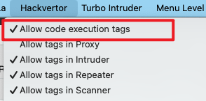
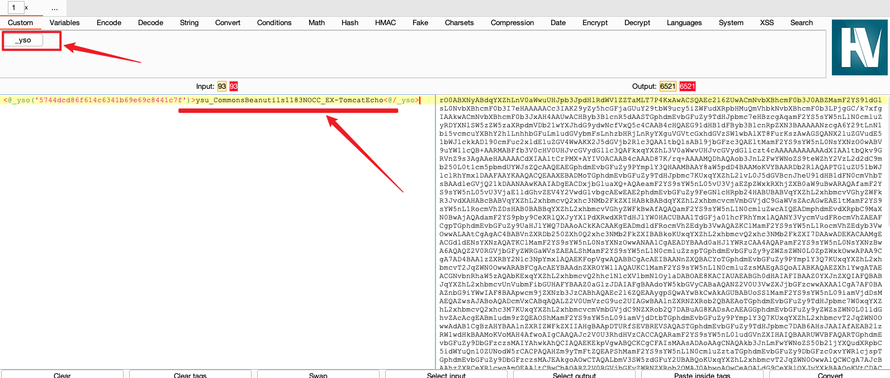

## hackvertor


https://github.com/hackvertor/hackvertor


```
实现标签化对数据进行 编解码
 例如： 
 base64加密: <@base64>123123<@/base64>
 gzip压缩： <@gzip_compress>123123<@/gzip_compress>
```


### ysuserial 快速调用生成java序列化数据

1、首先启用 hackvertor的 代码执行功能 `allow code execution tags`



2、新建一个自定义tags `yso` ，选择 python脚本

```
import os

output = input

p_lists = str(output).split("_")

if len(p_lists) == 3:
    yso_name = p_lists[0]
    gadget_name = p_lists[1]
    payload_name = p_lists[2]

    command = 'java -jar /Applications/"Burp Suite Professional.app"/Contents/Resources/app/ysuserial.jar -g ' + gadget_name + ' -p "'+ payload_name +'" | base64'
    result = os.popen(command).read()

    output = str(result)

    if output.startswith("rO0AB") or output.startswith("PGxp"):
        output = str(result)
    else:
        output = "errclass"
else:
    output = "errclass"

```

> 自行替换脚本中的 ysuserial.jar 位置

使用 如下 标签即可生成自定义java序列化数据

```
<@_yso('5744dcd86f614c6341b69e69c8441c7f')>ysu_CommonsBeanutils1183NOCC_EX-TomcatEcho<@/_yso>
```



